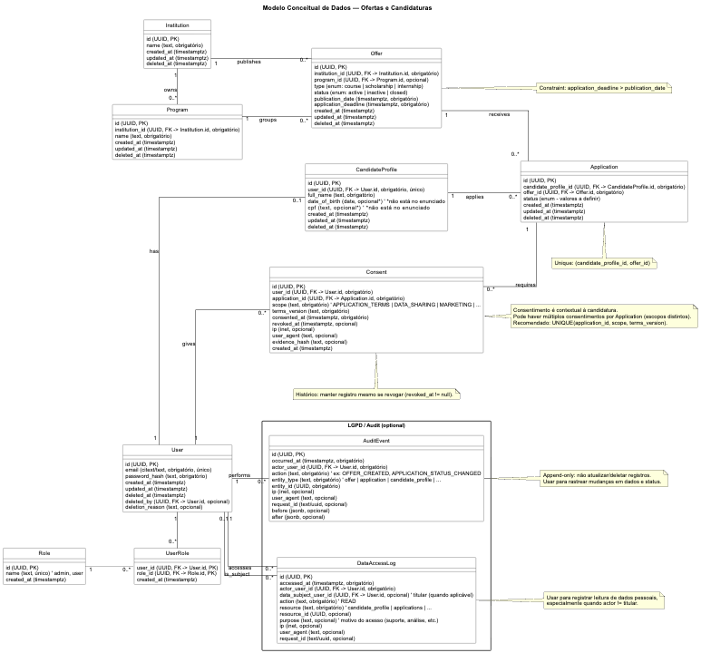

# Captura de Requisitos — Desafio técnico V-LAB - Líder em desenvolvimento

**Data:** 26/01/2026  
**Responsável:** Hítalo Nascimento  
**Status:** Rascunho

---

## 1. Contexto e Objetivo

- **Problema a resolver:** Desenvolver uma plataforma de gestão de ofertas acadêmicas para universidades brasileiras.
- **Objetivo**: Centralizar a gestão de ofertas acadêmicas e candidaturas, com controle de acesso e escalabilidade.
- **Público-alvo**: Universidades (admins) e candidatos.
- **Métricas**: nº de ofertas publicadas, candidaturas processadas, tempo de resposta da API.

---

## 2. Requisitos Funcionais (RF)

| ID | Feature | Descrição |
|---|---|---|
| RF-001 |  Auth | Cadastro de usuário com hash de senha (bcrypt). |
| RF-002 |  Auth | Login e emissão de JWT (impacta ao menos “usuário”, “roles”). |
| RF-003 |  Offer | CRUD de Offers: criar, listar (com paginação), obter por ID, atualizar, deletar. |
| RF-004 |  Offer | Listagem com filtros por institution, type (course/scholarship) e status. |
| RF-005 | Offer | Regra: apenas `admin` pode criar `offer` (RBAC). |
| RF-006 |  Application | Criar candidatura. |
| RF-007 |  Application | Listar candidaturas do usuário:  `GET /users/{id}/applications`. |
| RF-008 |  Application | Atualizar status da candidatura. |
| RF-009 |  Application | Regra: não permitir aplicar 2x na mesma offer; verificar deadline. |
| RF-010 | Application | Regra: application_deadline > publication_date (Sem datas conflitantes). |
| RF-011 | Application | Regra: candidato não pode aplicar para offer expirada. |
| RF-012 | Institution | Gerenciar instituições e seus programas associados, permitindo associação às offers. |
RF-013 | LGPD | Registrar alterações e acessos a dados pessoais para fins de auditoria.
<!-- 
| RF-014 |  |  |
| RF-015 |  |  | 
-->

---

## 3. Requisitos Não-Funcionais (RNF)

Sugestão: RNF-001, RNF-002...

| ID | Categoria | Descrição |
|---|---|---|
| RNF-001 | Segurança | Dados sensíveis, LGPD compliance obrigatório (impacta: minimização, rastreabilidade, controle de acesso, retenção/eliminação). |
| RNF-002 | Escalabilidade | Escalar para 100K+ usuários simultânios (impacta: índices, paginação, padrões de consulta) |
| RNF-003 | Manutenibilidade | Arquitetura flexível para acomodar mudanças frequentes de requisitos, com separação clara de camadas. |
| RNF-004 | Observabilidade | O sistema deve possuir logging estruturado e rastreabilidade de ações relevantes, incluindo alterações de estado e acesso a dados pessoais, de forma a suportar auditoria, diagnóstico de falhas e requisitos de LGPD (accountability). |
| RNF-005 | Manutenibilidade | O sistema deve ser projetado para fácil manutenção por um time reduzido (2–3 pessoas), com código autoexplicativo, separação clara de responsabilidades, padrões consistentes e baixo acoplamento entre camadas. |
<!--
| RNF-006 |  |  |
-->
<!-- Categorias comuns: Performance, Segurança, Observabilidade, Usabilidade/Acessibilidade, Confiabilidade, Manutenibilidade, Compatibilidade. -->

---

## 4. Dados e Validações

### 4.1 Entidades principais 

- **[Institution]**: Representa a instituição/universidade proprietária das ofertas e programas. Centraliza o “dono” institucional do catálogo e serve como chave de particionamento lógico (multi-instituição).

- **[Program]**: Representa programas vinculados a uma `institution` (ex.: programa de pós, edital, trilha), permitindo organizar ofertas por contexto institucional.

- **[Offer]**: Oferta acadêmica (curso, bolsa, estágio) publicada por uma `institution` e opcionalmente associada a um `program`. Contém tipo, status e janelas de publicação/candidatura (com regra `application_deadline > publication_date`).

- **[User]**: Identidade autenticável (cadastro/login) com credenciais (hash de senha) e trilha de ciclo de vida (soft delete + motivo). Serve como base para autorização (papéis) e para relacionar o titular de dados pessoais.

- **[Role]**: Catálogo de perfis de acesso (ex.: `admin`, `user/candidate`) usado para aplicar autorização baseada em papéis (RBAC).

- **[UserRole]**: Tabela de junção N:N entre `user` e `role`, permitindo que um usuário possua múltiplos papéis (e.g., admin + outro perfil) e suportando evolução futura de permissões.

- **[CandidateProfile]**: Perfil do candidato com dados pessoais separados de User (privacy-by-design). Vinculado 1:1 ao `user`. Pode conter campos adicionais (ex.: CPF, data de nascimento) e metadados de aceite/consentimento (ex.: versão de termos), com soft delete para suportar políticas LGPD.

- **[Application]**: Candidatura de um candidato (`candidate_profile`) para uma offer, com status do processo seletivo. Impõe unicidade por par (`candidate_profile_id`, `offer_id`) para evitar candidatura duplicada e respeita regras de prazo (não permitir apply após deadline).

LGPD / Audit (opcional na implementação inicial, recomendado no design):

- **[AuditEvent]**: Registro append-only de auditoria de alterações. Captura quem executou (`actor_user_id`), quando (`occurred_at`), qual ação (`action`) e qual registro foi afetado (`entity_type` + `entity_id`), além de contexto técnico (IP, user agent, request id) e diffs (`before`/`after`) para rastreabilidade de mudanças em dados sensíveis e estados críticos (ex.: status de candidatura).

- **[DataAccessLog]**: Registro de auditoria de acesso/leitura a dados (principalmente pessoais). Captura quem acessou (`actor_user_id`), quando (`accessed_at`), de quem são os dados (`data_subject_user_id`, quando aplicável), qual recurso foi consultado (`resource`/`resource_id`), finalidade (`purpose`) e contexto técnico (IP, user agent, request id). Ideal para rastrear acessos administrativos e suportar accountability LGPD.

### 4.2 Atributos por entidade

---

## 5. Decisões e Histórico de Mudanças

| Data | Mudança | Motivo | Autor |
|---|---|---|---|
| 26/01/2026 | Criação do documento | Início da captura de requisitos | Hítalo Nascimento |

