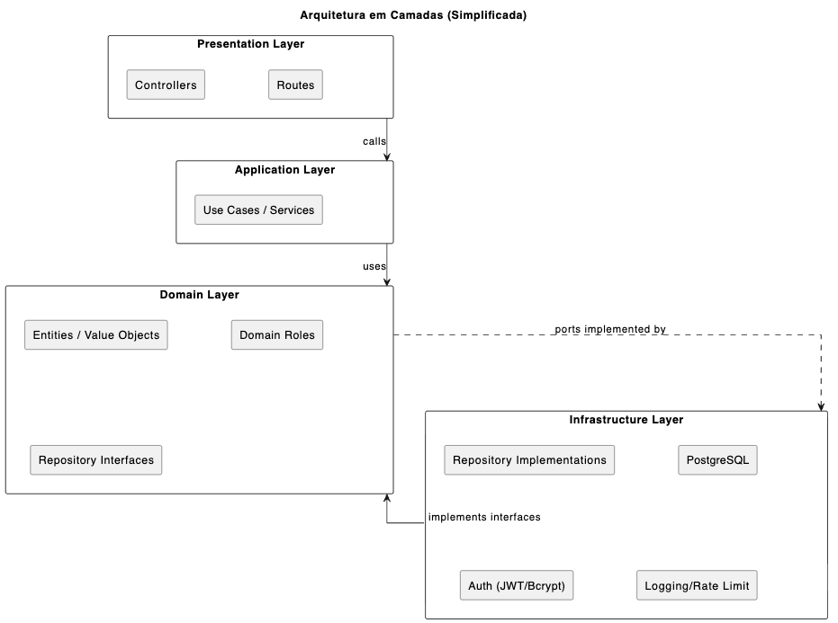

# Design Arquitetural — Plataforma de Gestão de Ofertas e Candidaturas (V-LAB)

**Data:** 26/01/2026  
**Autor:** Hítalo Nascimento  
**Status:** Rascunho (baseado na captura de requisitos e modelo conceitual)
**Referências:**
- [Captura de Requisitos](./requirements-capture.md)
- [Modelo Conceitual de Dados (PlantUML)](./diagrams/concept-data-model.puml)

## 1. Visão Geral

### 1.1 Contexto
Plataforma para universidades brasileiras gerenciarem **ofertas acadêmicas** (cursos, bolsas, estágios) e **candidaturas**, com consumo por múltiplos clientes (web/mobile/integrações). O sistema deve operar com **dados sensíveis**, exigindo conformidade com LGPD, além de escalar para **100K+ usuários simultâneos**, mantendo manutenibilidade (time backend pequeno).

### 1.2 Objetivo
Fornecer uma API versionada (v1) que suporte:
- Autenticação e autorização (RBAC)
- CRUD de ofertas com paginação e filtros
- Criação e gerenciamento de candidaturas com regras de negócio
- Rastreabilidade (auditoria de alterações e acessos) para LGPD

### 1.3 Escopo do núcleo funcional
Inclui:
- User registration + login + JWT
- CRUD Offers
- Applications (criar, listar por usuário, atualizar status)
- Regras: unicidade de candidatura por oferta e validação de prazo
- RBAC: apenas admin cria oferta
- LGPD logging (recomendado no design): auditoria de alteração + acesso

---

## 2. Modelo Conceitual de Dados

### 2.1 Entidades principais (conceitual)
- **Institution:** instituição/universidade proprietária das ofertas e programas.
- **Program:** programas vinculados à Institution (detalhes não definidos no desafio).
- **Offer:** oferta acadêmica (course/scholarship/internship) com status e janelas de candidatura.
- **User:** identidade autenticável (email + senha hash), com soft delete.
- **Role / UserRole:** RBAC via papéis e tabela de junção N:N.
- **CandidateProfile:** dados pessoais do candidato (separado de User, privacy-by-design), com soft delete.
- **Application:** candidatura do candidato para uma oferta, com status e constraints.

LGPD / Audit (recomendado no design):
- **AuditEvent:** trilha append-only de alterações relevantes (mudanças em dados e estados críticos).
- **DataAccessLog:** trilha de acesso/leitura a dados pessoais (accountability LGPD).

### 2.2 Regras e constraints no modelo
- **Unicidade:** `Application` deve ser única por `(candidate_profile_id, offer_id)`.
- **Datas:** `Offer.application_deadline > Offer.publication_date`.
- **Prazo:** candidato não pode aplicar em oferta expirada (validação no caso de uso de criação de candidatura).
- **Soft delete:** entidades de domínio principais mantêm histórico e evitam remoções físicas (principalmente por LGPD e integridade referencial).

---

## 3. Arquitetura de Camadas

### 3.1 Motivação
A separação em camadas reduz acoplamento, facilita testes, suporta mudanças frequentes de requisitos e melhora a manutenibilidade em um time pequeno.

### 3.2 Visão em camadas (alto nível)

### 3.3 Responsabilidades por camada
#### Presentation Layer (API)

Responsável por:

- Definir rotas e contratos HTTP (v1)
- Autenticação por JWT (guard/decorator)
- Validação de input via schemas (Pydantic)
- Mapeamento de erros para HTTP status + payload padronizado
- Paginação e filtros de listagem
- CORS e rate limiting (por IP)

*Não deve conter regra de negócio (apenas orquestração e validação de entrada/saída).*

#### Application Layer (Use Cases)

Responsável por:

- Orquestrar regras de negócio entre entidades e repositórios
- Aplicar validações que dependem de estado e persistência (ex.: deadline, unicidade)
- Emitir eventos de auditoria (AuditEvent) e logs de acesso (DataAccessLog) quando aplicável
- Controlar transações (quando necessário)

Exemplos de casos de uso:

- `RegisterUser`
- `LoginUser`
- `CreateOffer` (exige role admin)
- `ListOffers` (paginação/filtros)
- `CreateApplication` (unicidade + deadline)
- `UpdateApplicationStatus`

#### Domain Layer (Domínio)

Responsável por:

- Definir entidades e invariantes (Offer, Application, CandidateProfile etc.)
- Representar estados e valores do domínio (ex.: enums)
- Regras puras e invariantes locais (ex.: datas válidas para Offer, status permitidos)
- O domínio não depende de HTTP nem de banco.

#### Infrastructure Layer (Infra)

Responsável por:

- Persistência (PostgreSQL via ORM)
- Implementação de repositórios
- Integrações e utilitários técnicos (hash de senha, JWT provider, rate limit store se necessário)
- Migrações (Alembic)
- Observabilidade (logging estruturado)

---

## 4. Contratos de API (v1)
### 4.1 Autenticação e segurança

- POST `/api/v1/auth/register`
- POST `/api/v1/auth/login`
- Autorização via RBAC (roles em UserRole)
- Endpoints protegidos com guard/decorator `@require_auth`
- Rate limiting simples: `max X req/min` por IP (configurável)

### 4.2 Offers

- POST `/api/v1/offers` (admin-only)
- GET `/api/v1/offers?limit=20&offset=0`
- GET `/api/v1/offers/{id}`
- PUT `/api/v1/offers/{id}`
- DELETE `/api/v1/offers/{id}`
- Filtros: por institution, type, status

### 4.3 Applications

- POST `/api/v1/applications`
- GET `/api/v1/users/{id}/applications`
- POST `/api/v1/applications/{id}/status`

Validações obrigatórias no caso de uso:
- Unicidade por (candidate_profile_id, offer_id)
- Deadline válido (não aplicar para oferta expirada)

---

## 5. Observabilidade e LGPD Logging
### 5.1 Objetivo

Garantir rastreabilidade para:

- Alterações em dados e estados críticos (auditoria)
- Acesso/leitura de dados pessoais (accountability LGPD)
- Diagnóstico de incidentes (correlação por request)

### 5.2 AuditEvent (mudança)

Registrar eventos append-only para ações como:

- `OFFER_CREATED`, `OFFER_UPDATED`, `OFFER_DELETED`
- `APPLICATION_CREATED`, `APPLICATION_STATUS_CHANGED`
- `CANDIDATE_PROFILE_UPDATED`
- `USER_SOFT_DELETED`

Campos principais:

- `occurred_at`, `actor_user_id`, `action`, `entity_type`, `entity_id`, `before`, `after`, `request_id`

Boas práticas:

- Registrar apenas campos relevantes (minimização)
- Evitar dados pessoais completos em before/after quando não necessários

### 5.3 DataAccessLog (leitura)

Registrar acessos a recursos com dados pessoais, especialmente quando:

- ator (admin) acessa dados de outro titular (candidato)
- endpoints expõem CandidateProfile/Applications

Campos principais:

- `accessed_at`, `actor_user_id`, `data_subject_user_id`, `resource`, `purpose`, `request_id`

---

## 6. Decisões Técnicas Fundamentais
### 6.1 API: REST (versionada)

- REST atende bem CRUD e integrações diversas.
- Versionamento: `/api/v1/...` para estabilidade e evolução.

### 6.2 Autenticação/Autorização: JWT + RBAC

- JWT para autenticação stateless.
- RBAC para controlar ações administrativas (ex.: criar offer).

### 6.3 Banco de dados: PostgreSQL

Justificativa:

- Consistência (ACID) e integridade referencial (relacionamentos e constraints)
- Consultas com filtros e paginação bem suportadas com índices
- Melhor suporte a auditoria e logs estruturados (JSONB para before/after)

### 6.4 Tratamento de erros

- Payload de erro padronizado (ex.: `code`, `message`, `details`, `request_id`)
- HTTP status codes consistentes
- Logging estruturado por request

---

## 7. Requisitos Não-Funcionais e como a arquitetura atende
### RNF-001 Segurança / LGPD

- Separação User x CandidateProfile (privacy-by-design)
- Soft delete para histórico e retenção
- AuditEvent e DataAccessLog (accountability)
- Controle de acesso por RBAC

### RNF-002 Escalabilidade (100K+ simultâneos)

- Paginação obrigatória em listagens
- Índices nos filtros mais usados (institution, type, status)
- Design stateless com JWT (facilita escala horizontal) 

### RNF-003 Manutenibilidade / Flexibilidade

- Camadas bem definidas
- Use cases claros e testáveis
- Domínio desacoplado de frameworks

### RNF-004 Observabilidade (opcional)

- request_id para correlação
- logging estruturado
- auditoria de mudanças e acessos

---

## 8. Decisões técnicas

## Architecture Decision Records (ADRs)

## Architecture Decision Records (ADRs)

| ID | Arquivo | Título | Objetivo da Decisão |
|----|--------|--------|---------------------|
| ADR-001 | [3_adr_001_layers.md](./3_adr_001_layers.md) | Separação de Camadas | Definir a arquitetura em camadas (Presentation, Application, Domain e Infrastructure) para reduzir acoplamento, facilitar testes e suportar evolução do sistema. |
| ADR-002 | [4_adr_002_database.md](./4_adr_002_database.md) | Escolha do Banco de Dados | Justificar o uso de PostgreSQL como banco relacional principal, considerando integridade, relacionamentos complexos e requisitos de auditoria e LGPD. |
| ADR-003 | [5_adr_003_auth.md](./5_adr_003_auth.md) | Autenticação e Autorização | Definir JWT como mecanismo de autenticação e RBAC como estratégia de autorização para controle de acesso seguro e escalável. |
| ADR-004 | [6_adr_004_api.md](./6_adr_004_api.md) | Padrão de API | Adotar API RESTful como padrão de integração, favorecendo simplicidade, interoperabilidade e manutenibilidade. |
| ADR-005 | [7_adr_005_versioning.md](./7_adr_005_versioning.md) | Versionamento de API | Estabelecer versionamento por URL (`/api/v1`) para permitir evolução controlada e compatibilidade entre múltiplos clientes. |
| ADR-006 | [8_adr_006_lgpd.md](./8_adr_006_lgpd.md) | LGPD Logging e Auditoria | Definir estratégia de auditoria, rastreabilidade e minimização de dados pessoais para conformidade com a LGPD. |
| ADR-007 | [9_adr_007_delete_strategy.md](./9_adr_007_delete_strategy.md) | Estratégia de Exclusão de Dados | Definir o uso de *soft delete* como padrão para preservar histórico, integridade referencial e accountability, com *hard delete* restrito a cenários controlados. |
| ADR-008 | [10_adr_008_api_conventions.md](./10_adr_008_api_conventions.md) | Convenções de API | Estabelecer padrões consistentes para endpoints, payloads, paginação, filtros, status codes e envelope de erros, garantindo previsibilidade, integração facilitada e menor custo de manutenção. |
| ADR-009 | [11_adr_009_observability.md](./11_adr_009_observability.md) | Observabilidade | Definir estratégia mínima de logging estruturado, métricas, correlação de requisições e preparo para tracing, visando diagnóstico rápido, operação segura e escalabilidade com time reduzido. |

---

| **Anterior** | **Próximo** |
|-----------------|---------------|
| [Captura de Requisitos](./1_requirements_capture.md) | [ADR-001: Separação de Camadas](./3_adr_001_layers.md) |
